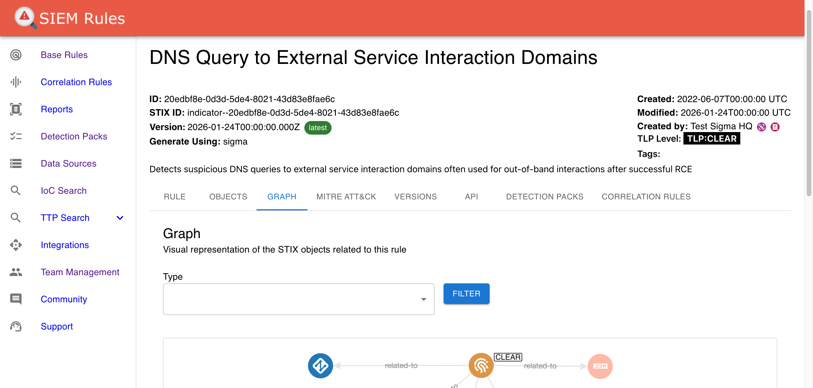

# sigma2stix

> **⚠️ ARCHIVED**: This repository is no longer actively maintained. All Sigma rules are now managed and available in [SIEM Rules](https://app.siemrules.com).

[](https://codecov.io/gh/muchdogesec/sigma2stix)

## tl;dr

A command line tool that converts Sigma Rules from the SigmaHQ repository into STIX 2.1 Objects.

Note: if you just want to convert an existing Sigma Rule into STIX, [check out txt2detection](https://github.com/muchdogesec/txt2detection/).

## Before you begin...



[You can access all of the rules generated by sigma2stix in SIEM Rules](https://www.siemrules.com).

## Overview

> Sigma is a generic and open signature format that allows you to describe relevant log events in a straightforward manner. The rule format is very flexible, easy to write and applicable to any type of log file.

[SigmaHQ/sigma](https://github.com/SigmaHQ/sigma)

Sigma Rules are written in a YAML format, and distributed as YAML files.

The public rules (approved by the Sigma team) are stored in the main Sigma repository, nested in the `rules*` directories, e.g.

`rules-emerging-threats/2023/Exploits/CVE-2023-20198/cisco_syslog_cve_2023_20198_ios_xe_web_ui.yml`

https://github.com/SigmaHQ/sigma/blob/master/rules-emerging-threats/2023/Exploits/CVE-2023-20198/cisco_syslog_cve_2023_20198_ios_xe_web_ui.yml

Here at dogesec, most of the data we deal with is in STIX 2.1 format. This is because downstream threat intelligence tools understand STIX.

Therefore sigma2stix works by converting Sigma Rules to STIX 2.1 objects.

sigma2stix provides two modes:

1. downloads the latest rules from the [SigmaHQ/sigma repository](https://github.com/SigmaHQ/sigma) and converts each rule into a range of STIX objects
2. accepts a Sigma rule in a YAML file and converts to a STIX indicator object

## Installing the script

To install sigma2stix;

```shell
# clone the latest code
git clone https://github.com/muchdogesec/sigma2stix
# create a venv
cd sigma2stix
python3 -m venv sigma2stix-venv
source sigma2stix-venv/bin/activate
# install requirements
pip3 install -r requirements.txt
```

### Configuration options

sigma2stix has various settings that are defined in an `.env` file.

To create a template for the file:

```shell
cp .env.example .env
```

To see more information about how to set the variables, and what they do, read the `.env.markdown` file.

## Running the script

### Mode 1: SigmaHQ/sigma repository -> STIX

```shell
python3 sigma2stix.py \
	--mode sigmahq \
	--sigma_version_tag XXXX
```

Where;

* `mode` (required): should always be `sigmahq` if you want to download the latest rules from the [SigmaHQ/sigma repository](https://github.com/SigmaHQ/sigma)
* `sigma_version_tag` (optional): is the name of the tag in the SigmaHQ/sigma repository ([tags listed here](https://github.com/SigmaHQ/sigma/releases)), e.g. `r2024-12-19`. If no value passed, the master branch will be cloned.

Note this script only supports Sigma Rule version tags in the format `rYYYY-MM-DD`.

On each run all objects will be regenerated in the `stix2_objects` directory

#### Example 1.1: Download latest (master)

```shell
python3 sigma2stix.py \
	--mode sigmahq
```

#### Example 1.2: Download specific version

```shell
python3 sigma2stix.py \
	--mode sigmahq \
	--sigma_version_tag r2024-12-19
```

## Mapping information

To see how sigma2stix maps data to STIX objects, [see txt2detection docs](https://github.com/muchdogesec/txt2detection/).

## Backfill old versions

You can use the following script to get a bundles of rules for every Sigma version published

```shell
sh utilities/backfill_all.sh
```

If you only want the latest version bundle, just run the last line of `utilities/backfill_all.sh` in your terminal.

## Useful supporting tools

* To generate STIX 2.1 Objects: [stix2 Python Lib](https://stix2.readthedocs.io/en/latest/)
* The STIX 2.1 specification: [STIX 2.1 docs](https://docs.oasis-open.org/cti/stix/v2.1/stix-v2.1.html)
* [SigmaHQ on GitHub](https://github.com/SigmaHQ)

## Support

[Minimal support provided via the dogesec community](https://community.dogesec.com/).

## License

[Apache 2.0](/LICENSE).